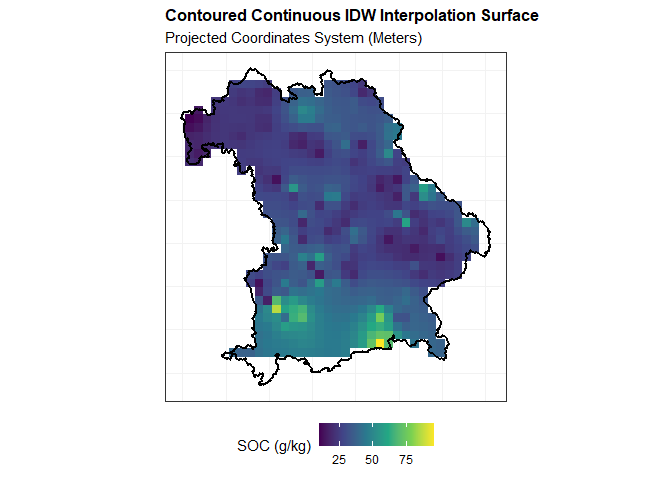
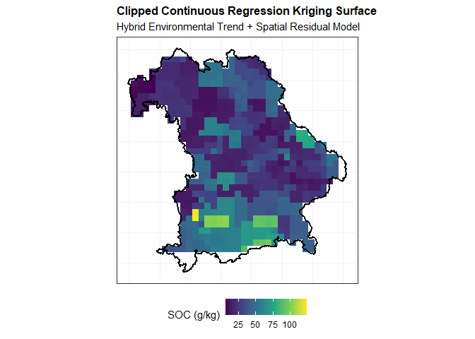

# SoilGeoStats

The goal of SoilGeoStats is to provide a reproducible, multi-tiered
spatial interpolation pipeline tailored for official topsoil
point-observation datasets.

This is a Data Analysis package structured around a regional
environmental case study in Bavaria, Germany, and inspired by a Spatial
Statistics course project carried out in a previous semester
[Geostatistical Analysis of
SOC](https://github.com/adebolaadedayo/Geostatistical-Analysis-of-SOC)
using ArcGIS.

It combines automated spatial data cleaning with both deterministic
modeling and advanced multivariate geostatistical analysis. While
initialized for a Bavarian environmental assessment, this package is
completely generic and can be dynamically applied to topsoil data across
other geographic locations.

## Target Users

The target users of this package are spatial data analysts,
environmental scientists, soil ecologists, and researchers who work with
soil point datasets and need a quick, reproducible pipeline to clip,
validate, and carry out geostatistical interpolation.

## Dataset and Source

- Topsoil Observations: The enclosed point dataset contains topsoil
  observations (0–20 cm depth) extracted from the official [LUCAS 2018
  Topsoil
  data](https://esdac.jrc.ec.europa.eu/content/lucas-2018-topsoil-data)
  compiled by the European Soil Data Centre (ESDAC). The dataset covers
  the European Union and the United Kingdom, containing attributes for
  elevation, pH, organic carbon content (OC), phosphorus, potassium, and
  nitrogen (N).

- Regional Boundary: The package accommodates an optional vector
  boundary polygon shapefile of Bavaria obtained from the Database of
  [Global Administrative Areas (GADM)](https://gadm.org/data.html) to
  dynamically isolate regional study areas.

- Coordinate Reference Systems: The raw LUCAS point dataset is provided
  in unprojected WGS84 (EPSG: 4326) coordinates, while the GADM boundary
  shapefile of Bavaria uses the projected ETRS89 / UTM zone 32N
  (EPSG: 25832) reference system. The package automatically reconciles
  this CRS mismatch during the ingestion pipeline.

## Analysis Workflow

The analytical pipeline enables a user to evaluate soil properties
sequentially through six distinct tiers:

- Data Validation and Geometric Clipping: Ingests tabular CSV profiles
  and an optional regional polygon mask, executing an automated spatial
  point-in-polygon clip.

- Distance Metrics: Builds geographic distance matrices to evaluate
  sampling intervals alongside exploratory data analysis summaries.

- Deterministic Interpolation: Computes a local spatial prediction
  matrix using Inverse Distance Weighting (IDW).

- Regression Kriging: Maximizes prediction accuracy by pairing Ordinary
  Least Squares (OLS) environmental trends (using Nitrogen and Elevation
  covariates) with spatial residual interpolation.

- Data Visualization: Transforms S3 prediction grids into
  boundary-clipped continuous map tile visualizations via ggplot2.

- Performance Validation: Evaluates model accuracy using iterative
  Leave-One-Out Cross-Validation (LOOCV) to output Mean Error (ME) for
  prediction bias and Root Mean Square Error (RMSE) for modeling
  precision.

## Installation

You can install the development version of SoilGeoStats from GitHub
using the `remotes` package:

``` r
# Install the development version from GitHub
# install.packages("remotes")
remotes::install_github("adebolaadedayo/SoilGeoStats")
```

## Demonstration Example

Here is a complete, reproducible walkthrough demonstrating how to
initialize the data, execute the dual-interpolation engines, evaluate
cross-validation accuracy metrics, and plot the resulting continuous
environmental surfaces:

``` r
library(SoilGeoStats)
library(sf)
#> Linking to GEOS 3.14.1, GDAL 3.12.1, PROJ 9.7.1; sf_use_s2() is TRUE
library(ggplot2)

# Step 1 & 2: Ingest data using built-in package system defaults and verify spacing
soil_points <- load_and_validate_data(file_path = system.file("extdata", "soil_data/LUCAS-SOIL-2018.csv", package = "SoilGeoStats"),
    x_col = "TH_LONG", # X coordinate column
    y_col = "TH_LAT", #Y coordinate column
    target_col = "OC",
    covariate_cols = c("N", "Elev"),
    shape_path = system.file("extdata", "shape_file/Bav_Boundary.shp", package = "SoilGeoStats"))
#> Warning: attribute variables are assumed to be spatially constant throughout
#> all geometries
spatial_EDA <- exploratory_data_analysis(spatial_data = soil_points, target_col = "OC")

# View exploratory metrics calculated by the pipeline
print(spatial_EDA$total_points)
#> [1] 124
print(spatial_EDA$minimum_sampling_interval_meters)
#> [1] 2827.095

# Step 3 & 4: Execute Interpolation Engines (Instantiates our custom S3 Classes)
idw_surface <- interpolate_idw_surface(spatial_data = soil_points, target_col = "OC")
rk_surface  <- interpolate_regression_kriging(spatial_data = soil_points, target_col = "OC", covariate_cols = c("N", "Elev"))

# Step 5: S3 Method Validation - Print Object Summary Metadata
print(idw_surface)
#> === Geostatistical Package Grid Object ===
#> Interpolation Method : IDW 
#> Target Soil Property : OC 
#> Grid Resolution      : 10000 meters
#> Total Active Nodes   : 1088 cells generated
#> ------------------------------------------

# Step 6: S3 Method Validation - Execute Automated Leave-One-Out Cross-Validation Math
summary(idw_surface)
#> === Running Leave-One-Out Cross-Validation Engine ===
#> Evaluating Method: IDW 
#> 
#> --- Validation Performance Metrics ---
#> Mean Error (ME)        : 0.19312 (g/kg)
#> Root Mean Square Error : 19.93917 (g/kg)
#> ======================================
summary(rk_surface)
#> === Running Leave-One-Out Cross-Validation Engine ===
#> Evaluating Method: Regression Kriging 
#> 
#> --- Validation Performance Metrics ---
#> Mean Error (ME)        : -0.35017 (g/kg)
#> Root Mean Square Error : 5.84593 (g/kg)
#> ======================================
```

## Map Visualizations

By using the custom S3 plot() method, you can pass the background
boundary file directly to generate beautifully clipped continuous map
tile surfaces:

``` r
# Load the background polygon file path from the package system
bavaria_layer <- sf::st_read(system.file("extdata", "shape_file/Bav_Boundary.shp", package = "SoilGeoStats"), quiet = TRUE)

# Render the continuous maps using our custom S3 plot methods
plot(idw_surface, boundary_data = bavaria_layer)
```



``` r
plot(rk_surface, boundary_data = bavaria_layer)
```


